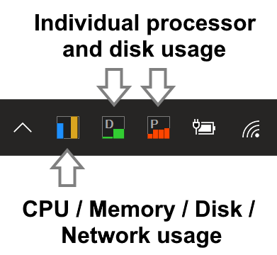

[Home](https://oscarkcau.github.io/Icon-Meter/) &emsp; [Downloads](downloads.md)  &emsp; [Screenshots](Screenshots.md) &emsp; [Lincense](licensepage.md)

Icon-Meter is a Small notifyicon system performance meter for MS Windows,
running on Microsoft Windows 7 or above using the Microsoft .NET Framework.

I need a small and lightweight system performance meter for my windows tablet thus make a simple application with c#. It displays small notifyicons which visualize the current CPU, memory, disk and network loading in small bars.
Icon Meter has the following features:

* (Version 2.3.1) Visualize individual disk usage, improve preformance in updating popup window, add buttons for moving popup window and accessing control panel & task manager.
* (Version 2.3) Introduce popup window to replace simple tooltip text and display more useful system performance information 
* (Version 2.1) Multi-language support (traditional Chinese, simplified Chinese, English and Japanese)
* (Version 2.0) Reimplement using WPF for better support for Windows 10
* Customizable bar colors
* Optionally hide / display bars of memory, disk and network performance
* (Version 1.1) Visualize individual logical processor usage
* Use vertical or horizontal bars
* Autostart when Windows start up
* Quick launch for Task Manager
* Display numerical readings in popup tooltip message when mouse cursor hovers over the meter

## Installation

Download and run the lastest [installer](https://github.com/oscarkcau/Icon-Meter/releases/latest).

## Usage

* Left click the meter icon to show the popup window. 
* Right click the meter icon to access the setup dialog (**setup** menu item), or to close the program (**Close** menu item).
* All settings could be found in the setup dialog.
* Double left click the meter to launch the system Task Manager.
* Currently 4 languages (traditional Chinese, simplified Chinese, English and Japanese) are supported, please switch to a new display language of your system to change the language.

