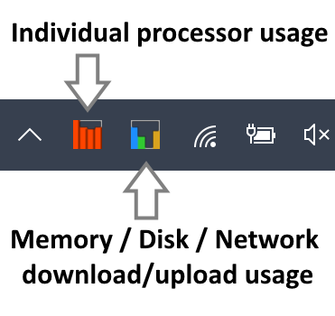
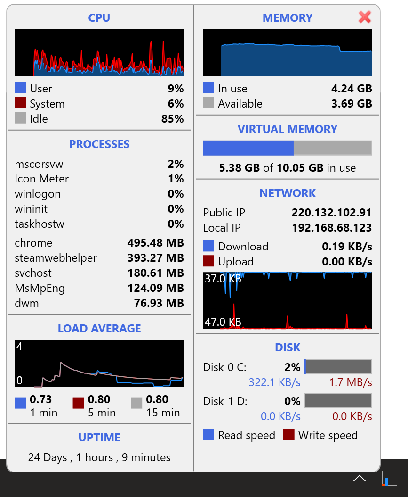
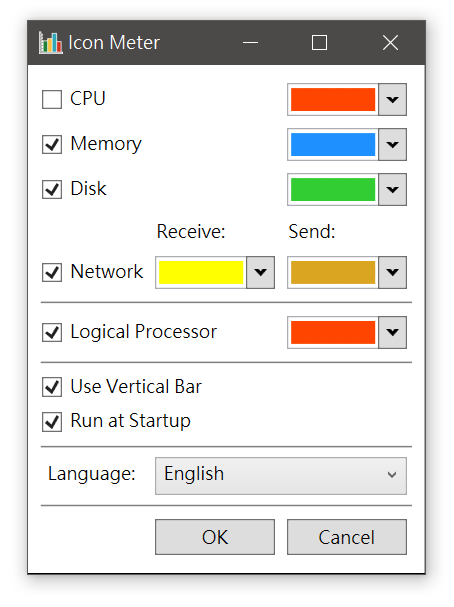

# Screenshots
Icon-Meter is a Small notifyicon system performance meter for MS Windows,
running on Microsoft Windows 7 x64 or above using the Microsoft .NET Framework.
 

Version 2.3 suppoerts popup window which displays more useful performance information including load average, IPs and disk read/write speed.
   

Setup window.
 

